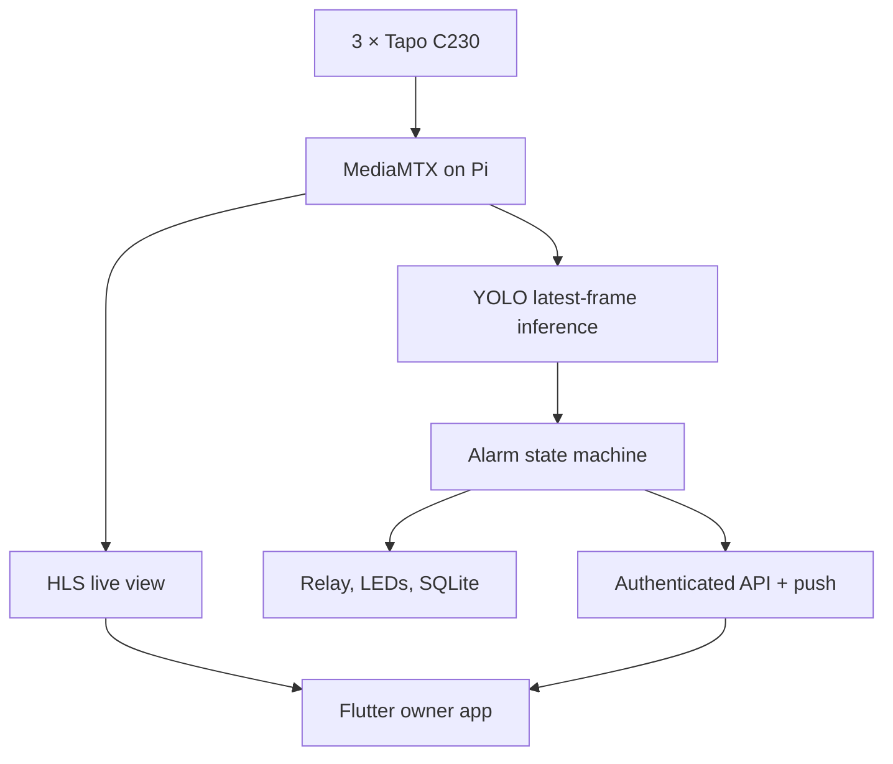

# Architecture and upgrade summary

## Responsibilities

| Component | Owns | Must not own |
|---|---|---|
| Tapo cameras | Capture and RTSP output | Alarm decisions |
| MediaMTX | One RTSP pull per camera, local restream, HLS | Fire classification |
| Detector | Latest-frame inference across three feeds | Physical siren state |
| State machine | Temporal confirmation, escalation, clearing | Claiming model confidence is severity |
| Alarm controller | Relay/LED output, temporary silence timer, manual activation | Disabling detection/history |
| API/database | Owner auth, events, settings, audit, status | Storing plaintext passwords/tokens |
| Mobile app | Fast owner access, visibility, controls | Being required for local alarm operation |

## Alarm states

| State | Meaning | Default action |
|---|---|---|
| Normal | No current qualifying detection | Green LED, no siren |
| Suspected | Some qualifying frames, not enough to confirm | Amber UI; optional notification; no siren |
| Confirmed | Required qualifying frames reached | Event/snapshot, push, red LED, siren if enabled |
| Critical | Confirmed detection persists | Higher-priority UI/push; siren remains active |
| Offline | Camera or detector unavailable | Visible fault warning; existing confirmed event stays latched |

Preset starting points are in `backend/app/domain.py`. They are calibration defaults, not universal fire thresholds.

## Security model

- Account passwords use PBKDF2-HMAC-SHA256 with per-account random salt.
- Access tokens are HMAC-signed and expire after 15 minutes.
- Refresh tokens are random, stored hashed on the Pi, rotated on use, and expire after 30 days.
- The phone stores tokens, owner cache, PIN salt, and PIN hash in platform secure storage.
- A PIN is four digits for fast emergency access, limited to five attempts; biometrics/device authentication are optional.
- Login is rate-limited on the Pi. Alarm-setting changes and manual actions are written to the audit log.
- Snapshots and thumbnails require an authenticated API request.
- The pilot HLS endpoint is LAN-only and is not authenticated. Do not expose ports 8000, 8554, or 8888 directly to the public internet. Add a VPN or authenticated TLS gateway before remote deployment.

## Current scope versus future work

Implemented now:

- three-camera RTSP ingestion and reconnection;
- latest-frame processing to prevent an ever-growing inference queue;
- shared YOLO model and per-camera temporal alarm state;
- real mobile camera/status/event/settings data;
- physical alarm controls, snapshots, audit, health, and optional FCM;
- remembered session, four-digit PIN, optional biometrics, and offline cache.

Requires site-specific work:

- real camera addresses and camera-account credentials;
- GPIO pin confirmation, relay polarity, electrical protection, and siren power sizing;
- Firebase project/service account if alerts are needed outside the open app;
- real release signing key and production network security;
- day/night calibration and acceptance testing with all three installed views;
- a multi-class model if screen-aware suppression is required.

